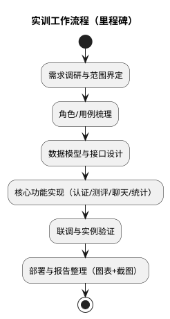

# 1 实训目的及内容简介

本实训以“Velum 学生心理评测数据分析系统”为对象，围绕校园心理测评的典型业务链路，完成从需求分析、总体设计、实现方案到实例验证的完整工程训练。系统采用前后端分离架构：学生通过 App 或 Web 完成测评与对话；管理人员在后台完成量表管理、数据统计与审计。

## 1.1 实训目的

1. 建立“需求—设计—实现—验证”闭环意识
   - 将校园场景中的角色、数据、流程转化为可实现、可验证的需求条目。
   - 通过工程图（架构、数据流、ER、流程等）把抽象需求落到可执行的设计上。

2. 掌握前后端分离与多端复用的系统组织方式
   - 以统一 API 作为业务边界，客户端只承担界面与交互。
   - 同一套前端能力可同时覆盖 Web 与桌面壳（可选），降低交付成本。

3. 训练“测评数据结构化 → 统计分析 → 可视化呈现”的数据链路能力
   - 把问卷题目、选项与答案以结构化形式沉淀，保证后续可统计、可追溯。
   - 在管理端形成可读的指标与图表，支持按时间、量表、用户等维度分析。

4. 强化安全与可追溯的工程意识
   - 身份认证、角色权限、传输保护、配置隔离与审计日志共同组成最小安全闭环。
   - 对敏感数据的处理策略明确：哪些可存、如何存、如何查、如何审计。

5. 将“智能化能力”作为可控的能力模块引入
   - 把大模型能力定位为“辅助解释与文本生成”，与结构化数据分析互补。
   - 支持流式返回以提升交互体验，并在系统层面考虑超时、失败、审计等问题。

## 1.2 实训内容（范围与模块）

系统围绕两类核心角色构建：

- 学生/普通用户：登录、填写心理测评、查看个人记录、进行 AI 对话与自助分析、个人设置等。
- 管理员（心理老师/辅导员/系统管理员）：用户管理、量表/问卷维护、任务与数据统计、系统配置与日志审计。

按业务能力划分，本次实训覆盖以下模块：

1. 账号与权限
   - 登录/注册（令牌化会话）、角色区分（管理员/普通用户）。
   - 重要接口需要鉴权；管理端操作需要更高权限。

2. 测评与结果沉淀
   - 量表/问卷的结构化定义（题目、选项、分值、语言、解释指引等）。
   - 用户提交答案后生成测评记录，记录包含得分、结论、答案明细与可选的文本分析结果。

3. AI 对话与辅助分析
   - 以“会话—消息”模型保存对话过程，支持会话列表与历史回溯。
   - 支持流式输出，提高“输入后即时反馈”的体验。

4. 管理端统计与可视化
   - 仪表盘：用户量、测评量、趋势与分布等核心指标。
   - 数据查询与导出：为后续业务研判与线下工作提供依据。

5. 系统设置与审计
   - 配置管理：模型地址/密钥等运行参数可配置化，减少运维改动成本。
   - 系统日志：记录关键行为与异常，便于排障、审计与责任追溯。

## 1.3 技术路线与约束说明（可选但本项目采用）

本项目允许“语言框架可自选”，但为满足快速交付与工程化要求，实际采用如下路线（用于本报告的方案与验证部分）：

- 服务端：REST 风格 API + 关系型存储（默认轻量数据库）+ 令牌鉴权。
- 客户端：单页应用（SPA）+ 状态管理 + 路由守卫 + 图表可视化。
- 智能化：兼容 OpenAI 协议的大模型服务接入，支持普通与流式两种响应方式。

约束与假设：

- 面向校园场景的原型系统：强调“工程链路完整与可验证”，不等同于临床级诊断系统。
- 数据以教学与实训为目的：默认按最小可用原则处理敏感信息，并提供审计与权限控制。

## 1.4 过程组织与里程碑

为避免“功能堆砌但不可交付”，实训按阶段推进：

## 1.5 主要交付物

- 实训报告（本系列文档）：需求分析、总体设计、实现方案、验证与总结。
- 可运行系统原型：学生端 + 管理端 + 服务端 API。
- 工程图与流程图：用于说明架构、数据流、实体关系与关键时序。

## 1.6 截图占位（后续补充）

为保证报告“图文并茂”，建议在下列位置补齐界面截图：

- 【截图占位：登录页（含语言/主题切换）】
- 【截图占位：学生端-测评列表与答题页】
- 【截图占位：学生端-AI 对话流式展示（发送前/发送中/发送后）】
- 【截图占位：管理端-仪表盘（卡片指标 + 趋势图/分布图）】
- 【截图占位：管理端-量表/问卷管理】
- 【截图占位：管理端-用户管理】
- 【截图占位：管理端-日志审计列表】
