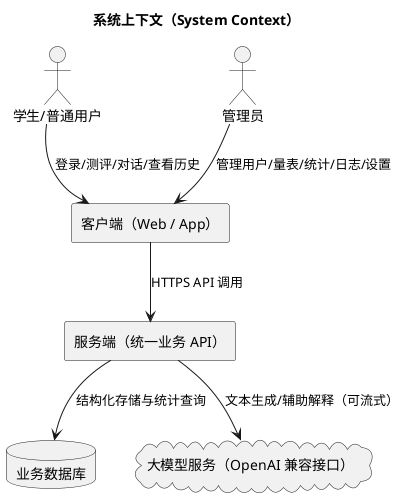

# 2 项目题目简介

## 2.1 项目名称

Velum 学生心理评测数据分析系统

## 2.2 项目背景

在校园心理健康教育与学生发展指导工作中，常见痛点集中在三个方面：

1. 数据难以沉淀：测评结果与访谈记录分散在多处，缺乏统一口径与结构化存储。
2. 管理成本高：用户、量表、任务分发与统计报表缺少统一后台，工作依赖人工汇总。
3. 反馈链路长：测评解释与建议高度依赖人工经验，难以做到及时、可读、可复用。

Velum 的设计目标是提供一个“可落地的原型系统”：在保证基本安全与可追溯的前提下，把测评、对话与统计分析放入同一套系统中形成闭环。

## 2.3 系统定位

- 学生端（App/Web）：完成测评与自助对话，查看个人历史记录。
- 管理端（后台）：完成用户管理、量表/问卷管理、统计分析、系统配置与日志审计。

系统采用前后端分离：客户端负责交互，服务端负责鉴权、业务、数据持久化与智能化能力接入。

## 2.4 建设目标（可验证的目标描述）

1. 形成“测评数据 + 对话数据”的统一数据底座
	- 测评：答案、得分、结论、解释文本可追溯。
	- 对话：以会话维度沉淀消息，支持回溯与审计。

2. 形成面向管理人员可使用的统计面板
	- 关键指标清晰：用户量、测评量、趋势与分布。
	- 支持常用查询：按时间、量表、用户等维度查看数据。

3. 形成最小安全闭环
	- 登录鉴权、角色权限、传输保护（可选）、日志审计。

4. 支持多端形态交付（可选）
	- Web 与桌面端可复用同一套界面能力，减少重复开发。

## 2.5 系统范围与边界

### 2.5.1 本次范围（In Scope）

- 账号体系与角色权限
- 量表/问卷的结构化管理
- 测评提交、计分与历史记录
- AI 对话（含流式展示）与可选的测评辅助解释
- 管理端仪表盘统计、日志审计、系统配置

### 2.5.2 不在范围（Out of Scope / 后续扩展）

- 与学校统一身份认证平台（SSO/LDAP）对接
- 临床级量表常模与信效度体系、医疗合规流程
- 多学校多租户隔离、全量脱敏与合规审计报表

## 2.6 角色与典型场景

### 2.6.1 角色定义

- 学生/普通用户：发起测评与对话，查看个人历史。
- 管理员：维护量表与用户，观察总体趋势与异常，处理配置与审计。

### 2.6.2 典型场景

1. 学生完成测评后立即看到得分与解释，并在个人历史中可追溯。
2. 学生在对话中描述近期状态，系统以会话方式保存内容，支持后续查看。
3. 管理员在仪表盘快速了解近期测评量、用户活跃与分布趋势。
4. 管理员通过日志追踪关键操作与异常，提升排障效率与责任可追溯性。

## 2.7 总体架构概述（系统上下文）

## 2.8 术语与缩写（便于后文统一口径）

- 量表/问卷：由题目与选项构成的测评模板。
- 测评记录：一次提交产生的结果，包含答案明细与得分。
- 会话：一次连续对话的容器，包含多条消息。
- 审计日志：记录关键操作、异常与来源信息，用于追溯。
- RBAC：基于角色的访问控制（Role-Based Access Control）。

## 2.9 截图占位

- 【截图占位：系统菜单与模块总览（学生端/管理端各一张）】
- 【截图占位：系统上下文图渲染效果】
