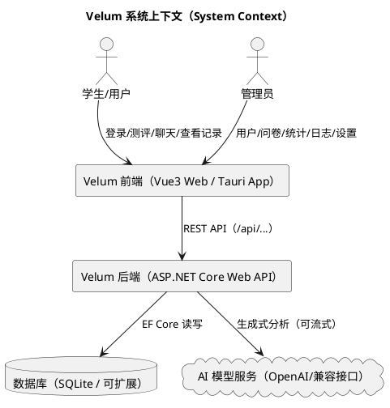

# 2 项目题目简介

## 2.1 项目名称

Velum 学生心理评测数据分析系统

> Velum 的命名寓意为“帷幕/面纱（velum）”：系统并非窥探个体隐私，而是为心理评测与对话提供一个安全、可控、可追踪的数字化支持平台。

## 2.2 项目背景与意义

在学校心理健康教育与学生发展指导中，心理测评与访谈记录是重要的数据来源。传统方式常见问题包括：

- 测评与数据分散：纸笔测评或独立问卷难以形成可复用的数据资产
- 管理成本高：缺少统一的后台管理、任务分发、统计汇总与审计机制
- 反馈滞后：测评结果解释依赖人工，难以快速给出可读性强的建议
- 多端体验割裂：学生端与管理端界面不统一，跨设备使用成本高

Velum 通过“前后端分离 + 数据结构化 + 可视化统计 + AI 辅助分析”的方案，将测评、对话、任务与分析整合到同一套系统中。

## 2.3 系统定位与目标

### 2.3.1 系统定位

- **面向学生端（APP/Web）**：完成心理测评、查看个人历史、进行 AI 对话与分析。
- **面向后台管理端**：管理员进行用户与数据管理、量表/问卷维护、统计分析与系统设置。

### 2.3.2 建设目标

- 形成一套可落地的校园心理评测信息化原型系统
- 支持“测评数据”与“对话数据”两类核心数据的存储与分析
- 通过角色权限控制与日志审计提升系统安全性与可追溯性
- 支持 Web 与桌面端（Tauri）一套代码多形态交付

## 2.4 系统范围（系统边界）

本系统聚焦“心理评测数据分析”与“后台管理”，不在本次范围内或仅作为未来扩展方向的内容包括：

- 学校统一身份认证（SSO/LDAP）对接
- 专业心理量表规范化（常模、信效度、临床解释）与医疗合规流程
- 多租户/多学校隔离、全量数据脱敏与审计报表

## 2.5 用户角色与典型使用场景

### 2.5.1 角色

- 普通用户（学生）：以个人心理测评与自助对话为主
- 管理员（心理老师/辅导员/系统管理员）：以数据与业务管理为主

### 2.5.2 典型场景

1. 学生登录系统并完成某个问卷测评，系统计算分数并记录
2. 学生在 AI 对话模块中描述近期情绪状态，系统按会话保存聊天记录
3. 管理员在仪表盘查看“测评总量、用户数量、近期测评”等关键指标
4. 管理员在日志模块查看关键操作痕迹，用于审计与追踪问题

## 2.6 总体架构概述（前后端分离 + 多端复用）

系统采用典型的前后端分离架构：

- 前端（Vue 3）：负责界面、交互、图表可视化、路由与权限引导
- 后端（.NET Web API）：负责业务逻辑、鉴权、数据存储、AI 调用与统计
- 数据库（SQLite 默认）：持久化用户、问卷、测评、聊天、日志、配置等
- AI 服务（兼容 OpenAI 协议的模型服务）：生成对话回复、问卷解析与文本分析

### 2.6.1 系统上下文图（PlantUML）

## 2.7 页面与功能模块概览（与代码一致）

前端路由已区分用户端与管理端（Hash 路由）：

- 用户端：仪表盘、聊天、测评、设置、小游戏
- 管理端：仪表盘、用户管理、任务管理、量表/问卷、分析、数据查询、日志、系统设置

> 【截图占位：系统功能总览页/导航菜单（用户端与管理端各一张）】
