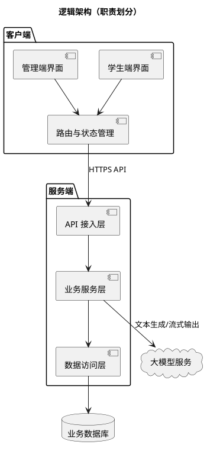
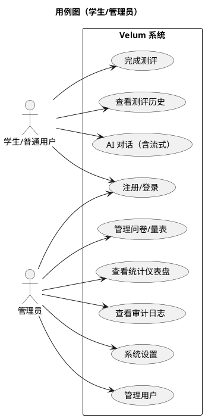
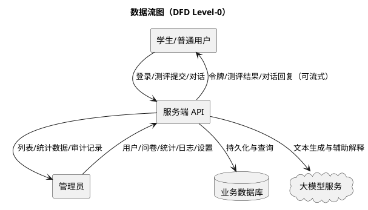
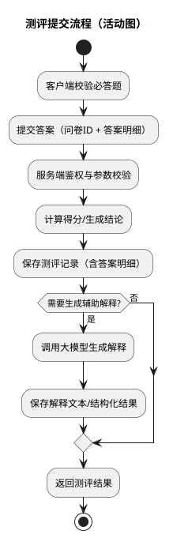
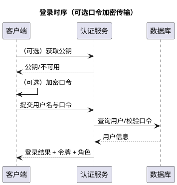
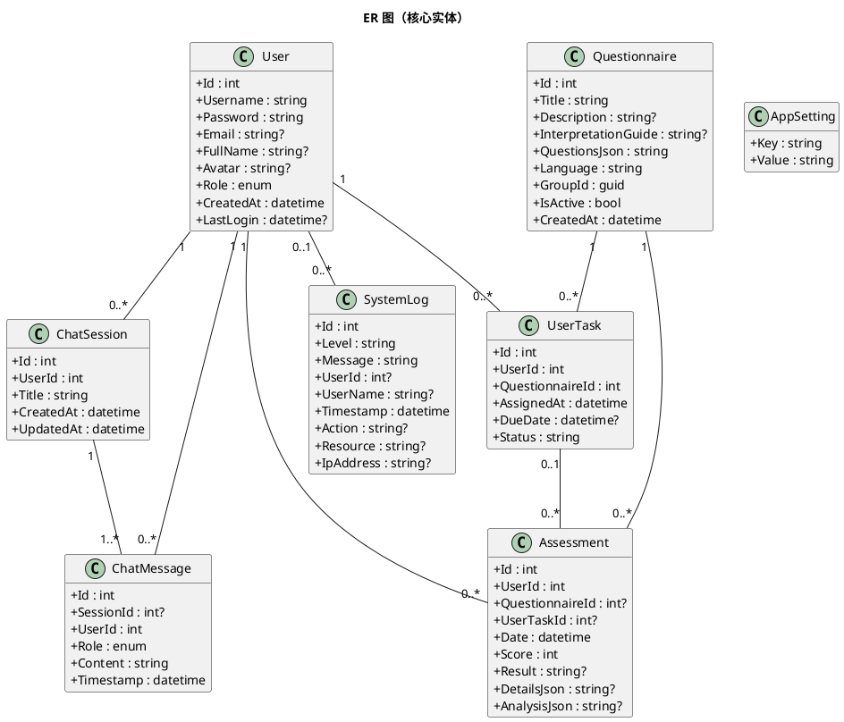

# 3 项目需求分析与设计

本章在调研同类系统的基础上，对项目需求进行结构化拆解，并给出可实现、可验证的总体设计。设计原则是：以结构化数据为中心，以权限与审计作为底线，以统计与可视化作为落点，并将大模型能力作为“可插拔的辅助模块”。

## 3.1 同类系统调研与设计要点提炼

### 3.1.1 同类方案的典型形态

从校园与通用市场实践看，相关系统常见三类形态：

1. 在线问卷/测评平台
   - 长处：制作发布快、收集成本低。
   - 短板：缺少校园管理场景（角色、分发、审计）；测评解释与统计多停留在“导出表格”。

2. 校园心理健康管理平台（含后台管理）
   - 长处：更贴近学校工作流程，具备用户管理、任务管理、统计报表。
   - 短板：多端体验割裂；“文本记录”和“结构化测评”之间联动不足；扩展能力受限。

3. AI 对话/陪伴类应用
   - 长处：交互自然、反馈及时，流式输出体验突出。
   - 短板：缺少量表体系与结构化数据沉淀；缺少学校场景的管理与审计能力。

### 3.1.2 设计要点（对本项目的直接约束）

结合上述形态与校园场景，本项目提炼出以下“设计要点”，作为后续需求与方案的约束条件：

- 数据结构化优先：测评模板与结果必须可计算、可统计、可追溯。
- 权限与边界清晰：学生端与管理端的能力、数据可见性与操作权限必须分离。
- 可解释与可用：面向管理人员的统计展示要“看得懂、用得上”。
- 安全底线：鉴权、传输保护（可选）、配置隔离与审计日志必须具备。
- 智能化可控：大模型能力用于辅助解释与文本生成，输出需可记录、可追溯。

## 3.2 需求分析

### 3.2.1 功能性需求（FR）

为避免“功能描述模糊”，本项目按业务域拆分需求，并为每组需求给出可验证的输入/输出。

#### FR-1 账号与权限

- FR-1.1 注册、登录、退出。
- FR-1.2 登录后获得令牌，并在后续请求中携带用于鉴权。
- FR-1.3 角色至少包含：普通用户、管理员。
- FR-1.4 权限隔离：管理端数据与操作必须具备管理员权限。
- FR-1.5 传输保护（可选）：提供公钥获取与客户端加密方案，用于降低明文口令在链路中的暴露风险。

#### FR-2 量表/问卷管理

- FR-2.1 管理员能够新增、编辑、启用/停用问卷。
- FR-2.2 问卷以结构化形式保存题目、选项、分值、语言与解释指引。
- FR-2.3 支持对问卷内容做解析与整理（可结合智能化模块实现“文本→结构化模板”的辅助）。

#### FR-3 测评与结果沉淀

- FR-3.1 用户能够选择问卷并提交答案。
- FR-3.2 服务端根据答案计算得分并生成测评记录。
- FR-3.3 测评记录保存答案明细（用于复核与统计）与结论文本。
- FR-3.4 支持将测评结果交给智能化模块生成辅助解释，并保存结果以便追溯。
- FR-3.5 用户能够查询自己的测评历史。

#### FR-4 AI 对话与会话管理

- FR-4.1 用户能够创建会话、查看会话列表、回溯会话消息。
- FR-4.2 用户发送消息后，系统生成回复并保存。
- FR-4.3 支持流式返回（分段输出），提升交互的即时性。
- FR-4.4 支持清理会话或删除会话（满足用户对数据的自主控制）。

#### FR-5 管理端统计、日志与设置

- FR-5.1 管理员能够查看仪表盘统计数据（数量、趋势、分布等）。
- FR-5.2 管理员能够检索系统日志（关键操作、异常、来源信息），用于审计与排障。
- FR-5.3 管理员能够维护系统运行配置（例如智能化模块的地址、密钥、模型参数等），减少运维改动成本。

### 3.2.2 非功能性需求（NFR）

- NFR-1 安全性：鉴权、权限隔离、重要操作审计；传输建议走 HTTPS。
- NFR-2 隐私性：最小化收集；敏感内容可追溯但不滥用；日志避免记录敏感明文。
- NFR-3 可靠性：服务端具备异常处理与超时控制；智能化调用失败不影响主流程存储。
- NFR-4 可维护性：业务模块边界清晰，可替换智能化实现与数据库实现。
- NFR-5 性能与体验：关键页面加载与主要接口响应可接受；流式对话减少“长等待”。
- NFR-6 可部署性：支持本地开发与生产部署；配置可通过环境变量/后台配置注入。

## 3.3 总体设计

### 3.3.1 逻辑架构（分层与职责）



### 3.3.2 用例图（角色视角）



## 3.4 关键业务流程设计（数据流与时序）

### 3.4.1 数据流图（DFD Level-0）



### 3.4.2 测评提交流程（活动图）



### 3.4.3 登录时序（含可选传输保护）



### 3.4.4 流式对话时序

```plantuml
@startuml
title 流式对话时序（保存会话 + 分段返回）

participant "客户端" as C
participant "对话服务" as Chat
database "数据库" as DB
cloud "大模型服务" as LLM

C -> Chat : 发送消息（会话ID + 文本）
Chat -> DB : 保存用户消息
Chat -> LLM : 发起流式生成请求
loop 分段输出
  LLM --> Chat : chunk
  Chat --> C : chunk（实时追加显示）
end
Chat -> DB : 保存完整回复
Chat --> C : 结束标记/完成

@enduml
```

## 3.5 数据设计（核心实体与关系）

说明：下图基于系统实际采用的核心实体整理，字段名以业务含义为准，用于表达关系、约束与审计能力。



数据设计要点：

- 测评记录保留答案明细（DetailsJson），便于复核与后续统计扩展。
- AI 解释结果单独存放（AnalysisJson），保证“结构化结果”和“文本解释”互不污染。
- 日志保留动作、资源与来源信息，用于审计与问题追踪。

## 3.6 权限与安全设计（最小安全闭环）

### 3.6.1 RBAC 权限模型

- 普通用户：仅可访问自己的测评与会话数据。
- 管理员：可访问统计、用户管理、问卷管理、系统设置与审计日志。

### 3.6.2 口令与传输保护策略

- 口令在链路上建议通过 HTTPS 传输。
- 系统提供“可选口令加密传输”机制：客户端使用公钥加密口令，服务端解密后校验。

重要说明（与当前实现一致）：

- 为实训与原型交付的简化，用户口令在存储侧目前为明文字段。该做法不适用于生产环境，正式系统应改为强哈希存储（如 PBKDF2/BCrypt/Argon2）并增加登录失败限制与审计策略。

## 3.7 截图占位（建议补充）

- 【截图占位：用例图/ER 图渲染效果】
- 【截图占位：测评提交流程（前端答题→提交成功）】
- 【截图占位：流式对话（同一条消息的两张连续截图，体现分段增长）】
