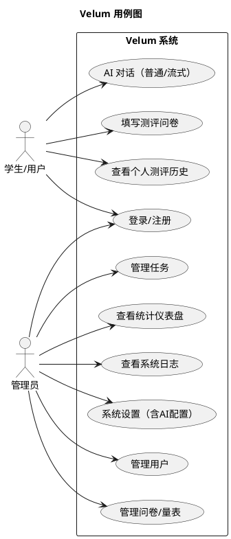
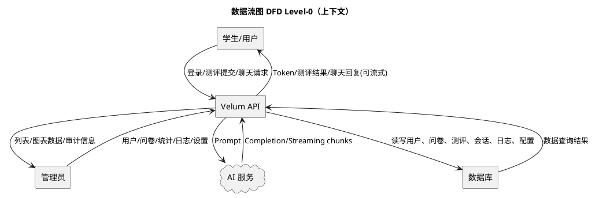
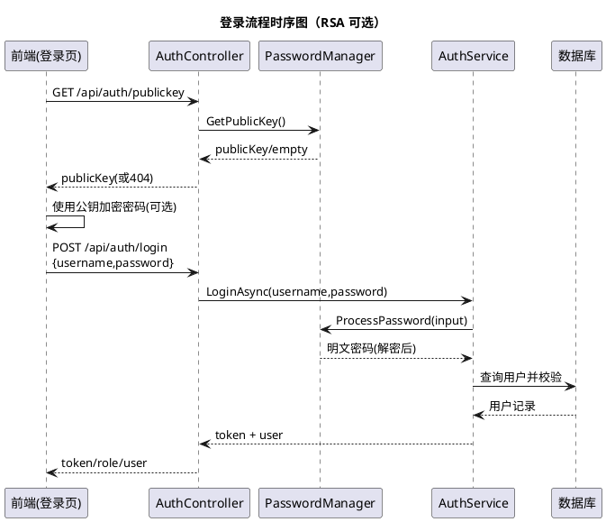
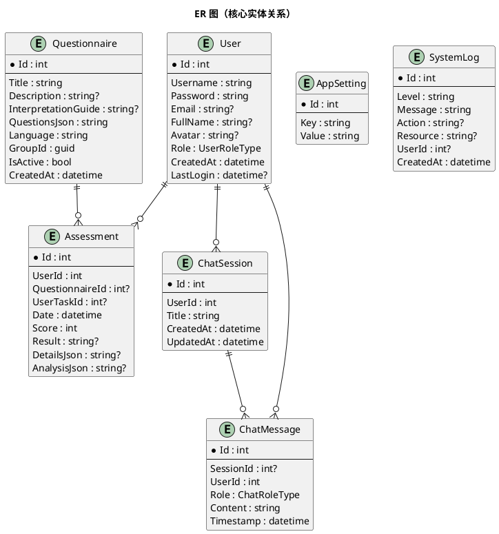

# 3 项目需求分析与设计

## 3.1 同类系统调研与设计要点提炼

### 3.1.1 市场同类产品/方案概览（调研归纳）

当前市场上与“学生心理评测/心理健康管理”相关的系统通常可分为三类（这里按功能形态归纳，不限定具体品牌）：

1. **心理测评问卷平台类**
   - 优点：问卷制作/发布简单、收集效率高
   - 不足：测评解释与分析能力有限；缺少针对学校业务的角色权限、审计、任务管理与数据闭环

2. **校园心理健康管理平台类（含后台管理）**
   - 优点：面向学校业务流程，具备用户管理、测评管理、统计报表
   - 不足：多端体验往往割裂；对话与个体化反馈弱；扩展性受限（如接口不开放、难以集成 AI）

3. **AI 心理陪伴/对话类应用**
   - 优点：交互性强，能提供情绪支持与文本建议；流式输出体验好
   - 不足：缺少量表体系与结构化数据沉淀；缺少学校场景的管理与分析能力；合规与可追溯要求更高

Velum 的设计目标是在“**测评结构化**”与“**AI 交互**”之间建立可落地的数据链路，并补齐校园后台管理能力。

### 3.1.2 设计要点提炼（对 Velum 的指导意义）

结合调研与学校场景特点，关键设计要点如下：

- **数据结构化优先**：问卷题目、选项与分值必须可计算、可统计、可追溯。
- **角色与权限清晰**：管理员与学生看到的功能不同，接口也必须隔离。
- **可视化与可解释**：统计图表与结果解释要面向非技术人员（心理老师/辅导员）可读。
- **安全与隐私保护**：至少具备传输加密、鉴权、日志审计、配置隔离；敏感信息不应直接暴露。
- **多端一致体验**：Web 与桌面端复用同一套前端工程与接口。
- **可配置与可运维**：AI Key/模型地址等应支持环境变量或后台配置，减少修改代码的运维成本。

> 代码落地对应：
> - 角色与权限：后端 `[Authorize]` / `[Authorize(Roles="admin")]`，前端路由 meta + 守卫；
> - 传输侧保护：支持 RSA 公钥获取 `/api/auth/publickey` 与前端加密；
> - 可配置：数据库 AppSettings 与 appsettings/环境变量双通道；
> - AI：支持流式接口 `/api/chat/stream`。

## 3.2 需求分析

### 3.2.1 功能性需求（FR）

#### A. 账号与权限

- FR-A1 用户注册、登录、退出
- FR-A2 登录成功后发放 JWT Token，前端保存并在后续请求中携带
- FR-A3 角色区分：User / Admin
- FR-A4 管理员接口必须具备角色鉴权；用户接口必须具备登录鉴权
- FR-A5 可选 RSA 密码加密传输：
  - 前端从后端获取 RSA 公钥
  - 前端使用公钥加密密码
  - 后端使用私钥解密后再进行校验

#### B. 心理测评/问卷

- FR-B1 管理员创建/维护问卷（题目、选项、分值、说明、语言等）
- FR-B2 用户拉取可用问卷并提交答案
- FR-B3 后端根据答案计算分数并保存测评记录
- FR-B4 用户可查看自己的测评历史
- FR-B5 支持将测评结果交由 AI 生成解释或建议（保存到 AnalysisJson）

#### C. AI 对话与会话管理

- FR-C1 用户创建会话、获取会话列表、查看会话内容
- FR-C2 用户发送消息，系统生成 AI 回复并存储
- FR-C3 支持流式输出（Streaming）改善体验
- FR-C4 支持清理聊天历史

#### D. 后台统计分析与运维

- FR-D1 管理员查看仪表盘统计数据（用户数、测评量、趋势等）
- FR-D2 管理员查看系统日志（操作审计/异常追踪）
- FR-D3 管理员维护系统配置（如 AI Key/模型等，至少支持环境变量与配置文件）

### 3.2.2 非功能性需求（NFR）

- NFR-1 安全性：JWT 鉴权、角色权限隔离、HTTPS 支持；关键操作写入日志
- NFR-2 可用性：接口响应稳定，AI 请求设置更长超时；前端路由守卫避免越权访问
- NFR-3 可维护性：后端以 Service 接口隔离业务；前端以路由分区 + Pinia 管理状态
- NFR-4 可扩展性：问卷题目采用 JSON 模型；AI BaseUrl 可替换；数据库可从 SQLite 迁移到其他关系型数据库
- NFR-5 可部署性：后端可 Docker 化；前端可静态化部署；桌面端可打包分发

## 3.3 总体设计

### 3.3.1 架构设计（分层 + 前后端分离）

```plantuml
@startuml
title Velum 总体架构（逻辑分层）

package "前端（Vue3）" {
  [用户端页面]\n/user/* as UserUI
  [管理端页面]\n/admin/* as AdminUI
  [路由守卫/状态管理]\nVueRouter + Pinia as FECore
}

package "后端（ASP.NET Core）" {
  [Controllers]\nAuth/Chat/Assessments/... as Controllers
  [Services]\nAuthService/ChatService/... as Services
  [Domain Models]\nUser/Assessment/Questionnaire/... as Models
  [Data Access]\nEF Core DbContext as DAL
}

database "SQLite(默认)" as DB
cloud "AI Service\n(OpenAI 兼容)" as AI

UserUI --> FECore
AdminUI --> FECore
FECore --> Controllers : HTTP(S) /api
Controllers --> Services
Services --> DAL
DAL --> DB
Services --> AI : ChatCompletion/Streaming

@enduml
```

### 3.3.2 模块设计（与代码结构对齐）

- 后端 API 模块（对应 Controllers）：
  - Auth：登录、注册、公钥获取
  - Chat：会话与消息、普通发送与流式发送
  - Assessments：提交测评、查看个人测评
  - Dashboard（管理员）：统计与图表数据
  - Questionnaire/Users/Tasks/Logs/Settings/Analysis/Games：后台业务扩展模块

- 后端核心领域模型（DbContext 中已注册）：
  - User、Questionnaire、Assessment、ChatSession、ChatMessage、UserTask、GameScore、AppSetting、SystemLog

- 前端路由模块：
  - /user：学生端功能
  - /admin：后台管理
  - /login：统一入口

## 3.4 关键业务流程设计（含工程图）

### 3.4.1 用例图（User / Admin）



### 3.4.2 数据流图（DFD Level-0：上下文级）



### 3.4.3 登录流程（含 RSA 可选加密）时序图



### 3.4.4 ER 图（核心数据模型）

> 说明：ER 图基于当前代码中的实体与 DbContext 关系整理，字段取自模型类；部分字段（如外键导航属性）用于表达关系。



## 3.5 前端设计要点（概要，后续在实现方案章节展开）

- 路由分区：`/user/*` 与 `/admin/*` 两套布局，统一登录入口 `/login`
- 路由守卫：根据 token 与角色进行跳转与限制
- 状态管理：Pinia 保存 token/role/user 等会话状态，配合 axios 携带鉴权信息
- 图表展示：ECharts 等组件用于仪表盘趋势与分布展示

## 3.6 截图占位（后续补充）

- 【截图占位：用例图对应的功能菜单（用户端/管理端）】
- 【截图占位：Swagger/OpenAPI 页面（接口列表与调试）】
- 【截图占位：仪表盘统计图表（趋势/分布）】

> 备注：第 4、5 部分将基于实际 Service/Controller 代码进一步细化流程与接口字段，并补充“测评计算 + AI 分析 + 统计聚合”的实现细节与实例验证。
