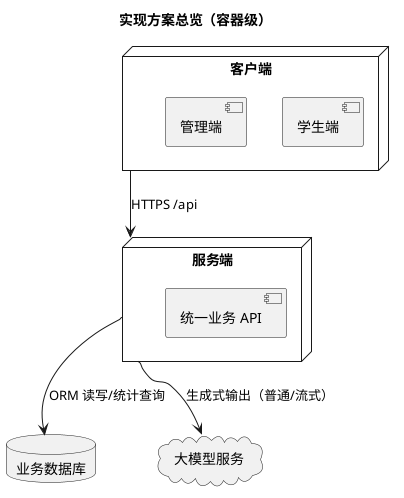
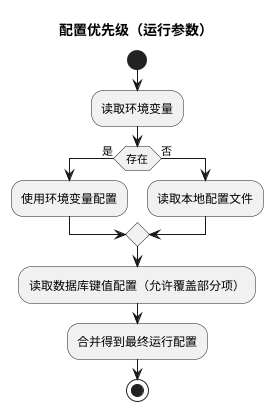
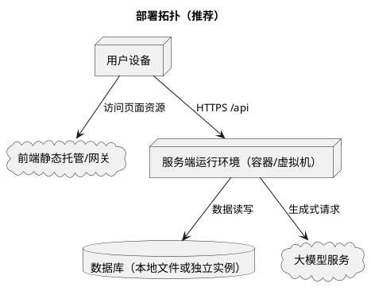

# 4 项目实现方案

本章给出针对需求的可落地实现方案。目标不是“把功能讲全”，而是把关键设计决策讲清：为什么这样分模块、数据如何流转、哪些点体现安全与可维护性，以及如何在可控成本下引入智能化能力。

## 4.1 方案概览

总体思路：

- 以服务端 API 作为唯一业务入口，统一鉴权、数据读写、统计计算与智能化调用。
- 客户端只负责界面与交互：学生端强调流畅与即时反馈；管理端强调可读的统计与可追溯。
- 数据以“结构化为主、文本为辅”：测评结果可统计、可复核；大模型输出作为辅助解释保存。

## 4.2 技术选型与理由（本项目采用）

说明：课程允许语言框架自选，本项目为了工程化与可交付性采用如下组合。

- 服务端：ASP.NET Core Web API
  - 理由：生态成熟、性能稳定、权限/中间件能力完善，适合做统一 API。
- 数据访问：EF Core + 关系型数据库（默认轻量数据库）
  - 理由：迁移与实体建模成本低；便于扩展到更强的数据库。
- 客户端：Vue 3 + TypeScript
  - 理由：组件化与工程化成熟，适合同时承载管理端与学生端。
- 智能化：OpenAI 兼容接口
  - 理由：接口标准化，可替换不同模型服务提供方；支持流式返回。
- 多端形态（可选）：Tauri
  - 理由：复用 Web 界面能力，以较低成本获得桌面端交付形态。

## 4.3 服务端实现方案

### 4.3.1 API 设计原则

- 风格：REST + JSON，URL 以资源为中心。
- 鉴权：除登录/注册/公钥等少数匿名接口外，默认需要令牌。
- 权限：管理员接口与普通用户接口隔离，避免“仅靠前端隐藏菜单”的伪安全。
- 可追溯：关键操作写入审计日志。

### 4.3.2 身份认证与权限控制

- 登录成功后签发 JWT（包含用户标识与角色）。
- 服务端对访问令牌做校验，对管理员接口做角色校验。

### 4.3.3 口令处理与传输保护（可选机制）

系统提供“公钥获取 + 客户端加密”的可选机制，用于降低口令在网络链路上的暴露风险：

- 客户端可先请求公钥。
- 客户端对口令加密后提交。
- 服务端解密后再进行校验与存储。

重要说明（与当前实现一致）：

- 目前口令在存储侧为明文字段，属于原型简化实现；生产系统必须改为强哈希存储，并加入失败次数限制、强密码策略与更细粒度审计。

### 4.3.4 数据持久化与迁移

核心实体包括用户、问卷、测评记录、会话消息、任务、配置与系统日志等。

设计要点：

- 测评记录保存答案明细（JSON）以支持复核与后续统计扩展。
- 会话与消息采用一对多关系，删除会话时级联清理消息，避免“孤儿数据”。
- 系统配置采用键值结构（AppSetting），便于在运行期调整模型地址/密钥等参数。

### 4.3.5 业务模块划分

为保证扩展性，服务端按业务域拆分为以下模块：

1. 认证模块
   - 登录、注册、获取公钥。
2. 用户管理模块（管理端）
   - 用户列表、信息维护、角色调整等。
3. 问卷/量表模块（管理端）
   - 问卷维护；支持“文本→结构化模板”的辅助解析；支持双语解析与文件解析。
4. 测评模块（学生端为主）
   - 提交答案、计算得分、保存记录、查询个人历史。
5. 对话模块（学生端为主）
   - 会话管理、消息保存；支持普通与流式两种生成方式。
6. 统计与分析模块（管理端）
   - 核心指标与图表数据；可扩展导出能力。
7. 设置与日志模块（管理端）
   - 运行配置维护；审计日志检索。

### 4.3.6 智能化能力接入

系统将大模型能力定位为两个方向：

1. 对话回复：用户输入 → 生成回复（支持流式返回）。
2. 辅助解析与解释：
   - 量表文本解析：把自然语言描述的量表整理为结构化题目。
   - 测评解释生成：基于得分与解释指引生成更易读的建议文本。

为了可运维性，模型地址、模型名称与密钥均支持配置化，且允许通过后台设置/数据库键值进行覆盖。

## 4.4 客户端实现方案

### 4.4.1 信息架构与路由分区

- 学生端：以“测评 + 对话 + 个人记录”为主，强调连续操作与即时反馈。
- 管理端：以“管理 + 统计 + 审计”为主，强调信息密度与检索效率。

### 4.4.2 状态管理与接口调用

- 统一封装 API 请求：自动附带令牌、统一处理错误提示。
- 使用状态管理保存用户信息、会话列表、统计数据等，避免页面间重复请求。

### 4.4.3 流式对话的前端处理

- 客户端按分段文本持续追加到同一条“AI 回复气泡”中。
- 在流结束后将最终文本视为一次完整回复，便于历史回溯与复制。

### 4.4.4 可视化与国际化

- 管理端统计采用图表组件展示趋势与分布。
- 支持语言切换与主题切换，提高可用性与可达性。

## 4.5 部署与运维方案

### 4.5.1 推荐部署拓扑

### 4.5.2 配置与安全建议

- 令牌签名密钥、模型密钥等敏感配置优先通过环境变量注入。
- 生产环境建议启用 HTTPS。
- 数据库建议使用持久化存储；若使用临时文件系统，应明确数据生命周期与备份策略。

## 4.6 关键接口设计（摘要）

本节只列出核心接口组与用途，便于和第 5 章的验证用例对应。

1. 认证
   - 获取公钥：`GET /api/auth/publickey`
   - 登录：`POST /api/auth/login`
   - 注册：`POST /api/auth/register`

2. 测评
   - 提交测评：`POST /api/assessments`
   - 获取个人测评历史：`GET /api/assessments/my`

3. 对话
   - 会话列表/创建/删除：`/api/chat/sessions`
   - 普通对话：`POST /api/chat/send`
   - 流式对话：`POST /api/chat/stream`

4. 问卷解析（管理端）
   - 文本解析：`POST /api/questionnaire/parse`
   - 双语解析：`POST /api/questionnaire/parse-bilingual`
   - 文件解析：`POST /api/questionnaire/parse-file`

5. 统计与审计（管理端）
   - 仪表盘统计：`GET /api/dashboard/stats`
   - 图表数据：`GET /api/dashboard/chart-data`
   - 审计日志：`GET /api/logs`

## 4.7 质量与风险控制

- 输入校验：对关键请求体做字段完整性与类型校验，避免脏数据落库。
- 超时与降级：智能化请求失败时，主流程仍应保证测评与会话数据可保存。
- 审计与追踪：对登录、配置修改、会话删除等动作记录日志，便于追溯。

主要风险与改进方向：

- 口令存储需从明文升级为强哈希。
- 流式对话需考虑客户端断连的补偿策略。
- 统计指标体系可从“数量/趋势”扩展到更可用的业务指标（分布、对比、预警）。

## 4.8 截图占位

- 【截图占位：管理端-系统设置（模型地址/密钥/模型名等）】
- 【截图占位：管理端-问卷解析（文本→结构化预览）】
- 【截图占位：接口文档页（Swagger/OpenAPI）】
