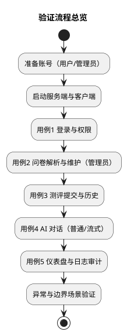

# 5 项目实例验证与分析

本章以“可复现、可核验”为原则，对系统关键链路进行实例验证，并在验证后给出工程视角的分析（正确性、可追溯性、失败场景、改进空间）。验证包含两条线：

1. 用户线：登录 → 测评 → 历史 → 对话（含流式）。
2. 管理线：问卷维护/解析 → 统计 → 日志审计 → 设置。

## 5.1 验证策略与准备

### 5.1.1 验证策略

- 覆盖关键业务链路：认证、测评、对话、统计、审计。
- 每个用例都包含：前置条件、操作步骤、预期结果、核验方式、截图占位。
- 重点核验两类“工程属性”：
  - 可追溯：能在数据库/日志中找到对应记录。
  - 可降级：智能化调用失败时不应破坏主流程存储。

### 5.1.2 前置条件

- 已部署并可访问服务端 API。
- 已部署并可访问客户端页面（或桌面端）。
- 已准备两类账号：普通用户账号、管理员账号。

截图占位：

- 【截图占位：运行环境（服务端启动成功/健康检查）】

## 5.2 用例 1：登录与权限验证（含可选传输保护）

### 5.2.1 目的

- 验证登录成功后可获得令牌与角色信息。
- 验证普通用户无法访问管理端能力（权限隔离）。
- 验证可选的公钥获取与口令加密传输链路。

### 5.2.2 步骤

1. 打开登录页，输入普通用户账号口令并登录。
2. 观察登录成功后的跳转：应进入学生端。
3. 尝试访问管理端页面：应被拦截或提示无权限。
4. 使用管理员账号登录：应进入管理端。
5. （可选）若启用加密传输：先获取公钥，再提交加密口令。

### 5.2.3 预期结果与核验

- 登录响应返回令牌与角色。
- 普通用户无法执行管理员操作。
- 审计日志中记录登录动作（成功/失败）。

截图占位：

- 【截图占位：登录页（含语言/主题切换）】
- 【截图占位：普通用户登录成功后的首页】
- 【截图占位：普通用户尝试进入管理端的拦截提示】
- 【截图占位：管理员登录成功后的仪表盘】
- 【截图占位：网络面板中登录请求与响应（包含 token/role）】

## 5.3 用例 2：问卷解析与维护（管理员）

### 5.3.1 目的

- 验证管理员可维护问卷，并可将文本/文件解析为结构化模板。
- 验证解析失败时有明确提示，不产生脏数据。

### 5.3.2 步骤

1. 管理员进入“量表/问卷管理”。
2. 输入一段量表文本，触发“解析”生成结构化题目预览。
3. （可选）使用“双语解析”，验证中英文两套题目输出。
4. （可选）上传文件进行解析，验证文件解析链路。
5. 将解析结果保存为问卷，设置为启用状态。

### 5.3.3 预期结果与核验

- 解析结果包含题目列表，题目类型、选项与分值信息完整。
- 保存后在问卷列表中可见，且学生端可拉取并参与测评。
- 审计日志记录问卷相关操作。

截图占位：

- 【截图占位：管理端-问卷解析输入与结果预览】
- 【截图占位：管理端-问卷列表（启用/停用状态）】
- 【截图占位：解析失败的提示（输入不规范时）】

## 5.4 用例 3：测评提交、计分与历史回溯

### 5.4.1 目的

- 验证测评提交产生测评记录，并保存答案明细。
- 验证得分计算与结论生成逻辑可解释、可复核。
- 验证历史记录可回溯。

### 5.4.2 步骤

1. 普通用户进入“测评”模块，选择一个已启用问卷。
2. 完成答题并提交。
3. 查看提交结果（得分/结论/解释文本）。
4. 进入“测评历史”或个人记录页，确认可看到刚提交的一条记录。

### 5.4.3 预期结果与核验

- 数据库中新增测评记录：包含用户标识、问卷标识、得分、答案明细（JSON）。
- 若启用了智能化解释：解释结果被保存并可回看。
- 若存在任务分发：提交后任务状态从待完成变更为已完成。

说明（与当前实现一致）：

- 计分采用“答案数值累加”的示例规则，适合作为原型验证；若用于正式量表，应将分值映射、反向计分、维度分计算等规则纳入问卷定义。

截图占位：

- 【截图占位：学生端-测评列表】
- 【截图占位：学生端-答题页（进度条/题型示例）】
- 【截图占位：提交成功提示】
- 【截图占位：测评历史列表与详情】
- 【截图占位：数据库中测评记录（包含 DetailsJson/AnalysisJson 字段）】

## 5.5 用例 4：AI 对话验证（普通与流式）

### 5.5.1 目的

- 验证对话会话可创建、消息可持久化。
- 验证流式输出在界面上呈现为“内容持续增长”。

### 5.5.2 步骤

1. 普通用户进入“AI 对话”。
2. 新建会话，发送一条消息。
3. 观察 AI 回复：
   - 普通模式：等待完成后一次性显示。
   - 流式模式：边生成边追加显示。
4. 刷新页面或重新进入：确认会话与消息仍可回溯。
5. 删除会话：确认会话与消息被同步清理。

### 5.5.3 预期结果与核验

- 数据库中存在会话记录与消息记录（用户消息与 AI 消息成对出现）。
- 流式模式下，网络请求为持续连接，响应内容分段到达。
- 审计日志记录删除会话等关键动作。

截图占位：

- 【截图占位：AI 对话页整体（会话列表 + 消息区 + 输入区）】
- 【截图占位：同一条 AI 回复的两张连续截图（体现流式增长）】
- 【截图占位：删除会话的确认与结果】
- 【截图占位：网络面板中流式响应（text/plain 分段）】

## 5.6 用例 5：管理端仪表盘与审计日志

### 5.6.1 目的

- 验证仪表盘统计数据与图表可正常展示。
- 验证日志检索可用于追踪关键行为。

### 5.6.2 步骤

1. 管理员进入仪表盘，查看核心指标卡片与趋势/分布图。
2. 切换时间范围或维度（如有），观察图表刷新。
3. 进入日志审计页面，检索包含“登录”“问卷”“会话删除”等关键动作的记录。

### 5.6.3 预期结果与核验

- 指标与图表数据与数据库中的数量级一致（用户数、测评数、会话数等）。
- 日志记录包含：时间、动作、资源标识、操作者与来源信息。

截图占位：

- 【截图占位：管理端-仪表盘（指标卡片 + 图表）】
- 【截图占位：管理端-日志审计列表（含筛选/检索结果）】

## 5.7 异常与边界场景分析

为验证系统“可用但不脆弱”，建议补齐以下边界场景：

1. 无效令牌/过期令牌：应返回未授权，并在客户端引导重新登录。
2. 无效问卷/禁用问卷：应阻止提交或提示不可用。
3. 智能化服务不可用：
   - 对话：应提示失败但不影响会话/用户消息的保存。
   - 测评解释：应允许先保存测评记录，解释结果可为空或后补。
4. 流式连接中断：应有明确的 UI 提示，且避免产生“半条消息”的误导展示。

## 5.8 结果分析与改进建议

通过上述验证，可以得到以下结论：

- 结构化数据链路成立：问卷 → 测评记录 → 统计查询具备工程闭环。
- 交互体验更接近实际使用：流式输出降低等待感，适合对话场景。
- 安全底线具备雏形：令牌鉴权 + 角色隔离 + 审计日志形成最小闭环。

主要改进建议（与实际实现相符）：

- 口令存储从明文升级为强哈希，并补齐失败次数限制与强密码策略。
- 将对话历史纳入生成上下文，提高回复一致性；并加入敏感内容与风险提示策略。
- 对流式断连做补偿：例如在服务端按段落落库或在客户端提供“重试/续写”。

## 5.9 截图占位汇总

- 【截图占位：用例1 登录成功与越权拦截】
- 【截图占位：用例2 问卷解析预览与保存结果】
- 【截图占位：用例3 答题过程与历史记录】
- 【截图占位：用例4 流式对话增长对比】
- 【截图占位：用例5 仪表盘与日志审计】
