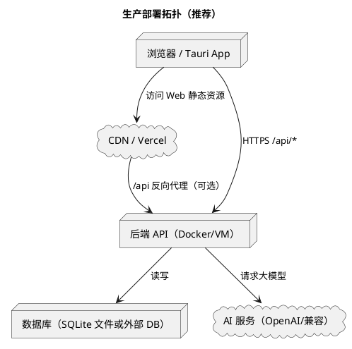

# 6 实训总结（含部署流程）

本章给出系统部署流程（后端、Web 前端、Tauri 桌面端）以及实训总结。部署部分以仓库已有脚本与配置为依据，尽量做到“可复用、可落地、可排障”。

## 6.1 部署目标与推荐拓扑

### 6.1.1 部署目标

- 后端 API 稳定对外提供服务（HTTP/HTTPS）
- 前端 Web 可通过域名访问，能正确访问后端 `/api/*`
- 桌面端（Tauri）可在 Windows 等平台安装运行，复用同一前端 UI
- 配置可通过环境变量/本地覆盖文件管理，敏感信息不写死到仓库

### 6.1.2 推荐拓扑（生产）



## 6.2 后端部署（ASP.NET Core Web API）

### 6.2.1 关键配置项（建议用环境变量注入）

后端配置来源优先级（从代码行为归纳）：

1. 环境变量（`builder.Configuration.AddEnvironmentVariables()`）
2. `appsettings.local.json`（本地覆盖，文件可不存在）
3. `appsettings.json` 默认配置
4. 部分配置允许从数据库 `AppSettings` 表读取（如 AI Key/Model/Url），用于运行期调整

生产环境建议重点配置（至少）：

- `Jwt__Key`：JWT 签名密钥（强随机，至少 32 字符）
- `Jwt__Issuer`、`Jwt__Audience`
- `OpenAI__ApiKey`、`OpenAI__BaseUrl`、`OpenAI__Model`
- `ConnectionStrings__DefaultConnection`：数据库连接
- `Rsa__Enabled`、`Rsa__PublicKey`、`Rsa__PrivateKey`（如启用 RSA）

截图占位：
- 【截图占位：服务器环境变量配置界面（如 1Panel/Render/VPS）】

### 6.2.2 Linux 服务器 Docker 部署（含 HTTPS，仓库脚本方式）

仓库提供了 [scripts/backend-docker.sh](scripts/backend-docker.sh) 用于构建并运行容器，并支持挂载证书提供 HTTPS 端口。

核心特性：

- 端口：HTTP 17597，HTTPS 16796
- 数据持久化：将 SQLite 数据库放到容器外部挂载目录 `/data/velum.db`
- 证书：从 1Panel 默认路径复制到临时目录并挂载到容器 `/https`

部署步骤（在 Linux 服务器项目根目录执行）：

```bash
# 进入仓库根目录
cd /path/to/Velum

# 一键构建并运行（默认 all）
sudo bash scripts/backend-docker.sh all

# 或者分步
sudo bash scripts/backend-docker.sh build
sudo bash scripts/backend-docker.sh run
```

验证：

```bash
curl http://localhost:17597/api/auth/publickey
curl -k https://localhost:16796/swagger
```

建议截图点位：
- 【截图占位：docker ps 显示 velum-backend 容器运行】
- 【截图占位：浏览器访问 https://<域名>:16796/swagger】
- 【截图占位：服务器证书目录与挂载目录（/opt/1panel/tmp/ssl/...）】

注意事项：

- 若服务器不使用 1Panel，请自行调整脚本中的 `CERT_SOURCE_PATH` 或改用 nginx/caddy 终止 TLS。
- 若只使用 HTTP（无证书），可在容器层仅暴露 17597，并在上层反代做 HTTPS。
- 生产环境应关闭 Swagger（代码中仅非 Production 环境启用）。

### 6.2.3 云平台部署（Render 示例：Docker Runtime）

仓库 [backend/README.md](backend/README.md) 给出了 Render 部署步骤，核心要点：

- Root Directory 选择 `backend`
- Runtime 选择 Docker
- 通过 Environment Variables 注入 `Jwt__Key`、`OpenAI__ApiKey` 等

重要提醒：

- Render 免费实例文件系统可能是临时的，SQLite 数据可能因重启/重新部署丢失。
- 若需要持久化：使用 Render Disk 挂载，或将数据库迁移到托管 PostgreSQL/其他 DB。

建议截图点位：
- 【截图占位：Render Web Service 配置页（Root Directory/backend、环境变量）】

### 6.2.4 Windows 单机发布（可选）

仓库提供了 [scripts/backend-publish.ps1](scripts/backend-publish.ps1) 用于发布 Windows 单文件版本：

```powershell
# 在仓库根目录执行
powershell -ExecutionPolicy Bypass -File scripts\backend-publish.ps1
```

产物默认输出到 `backend/dist`。

建议截图点位：
- 【截图占位：backend/dist 目录发布产物列表】

## 6.3 前端 Web 部署（Vue3 + Vite）

### 6.3.1 前端访问后端的配置机制

前端 axios 实例在 `frontend/src/lib/api.ts`：

- 开发环境（`import.meta.env.DEV`）：默认使用 `baseURL='/api'`，交给 Vite 代理（见 `vite.config.ts`）转发到后端 `http://localhost:17597`
- 生产环境：
  - 若未配置 `VITE_API_BASE_URL`，代码默认指向 `https://azure.modestwang.cn:16796/api`（示例值）
  - 因此在你的部署中，建议通过环境变量 `VITE_API_BASE_URL` 覆盖为你自己的后端地址

### 6.3.2 Vercel 部署（仓库已有说明）

仓库 [frontend/README.md](frontend/README.md) 给出了 Vercel 部署步骤，建议按如下执行：

1. Vercel 导入 Git 仓库
2. Root Directory 选 `frontend`
3. Build Command：`npm run build`
4. Output Directory：`dist`
5. 环境变量：
   - `VITE_API_BASE_URL`：填写你的后端地址，并带 `/api` 后缀

示例：

```text
VITE_API_BASE_URL=https://your-domain:16796/api
```

另外，仓库还提供了 `frontend/vercel.json` 的 rewrites（将 `/api/*` 重写到示例后端）。如果你选择使用 rewrites，需要把其中目标域名替换为你的后端域名。

建议截图点位：
- 【截图占位：Vercel 项目配置（Root Directory/frontend、环境变量 VITE_API_BASE_URL）】
- 【截图占位：Vercel 部署成功后的域名访问首页】

### 6.3.3 静态服务器部署（Nginx 示例，可选）

在你自己的服务器上部署 Web 前端的通用步骤：

```bash
cd frontend
npm install
npm run build
# 得到 dist/
```

然后将 `dist/` 放到 nginx 静态目录，并确保前端路由（hash 模式）能够工作；同时可配置 `/api` 反向代理到后端。

建议截图点位：
- 【截图占位：服务器上 dist 目录与 nginx 配置片段】

## 6.4 Tauri 桌面端部署（Web UI + 原生壳）

Tauri 配置位于 `frontend/src-tauri/tauri.conf.json`：

- `beforeDevCommand`: `bun run dev`
- `beforeBuildCommand`: `bun run build`
- `frontendDist`: `../dist`

### 6.4.1 开发运行（联调）

桌面端联调通常需要同时启动后端与前端。仓库提供 Windows 脚本 [scripts/start-dev.ps1](scripts/start-dev.ps1) 可同时启动后端与前端（使用 bun）。

Tauri 开发调试命令示例（在 `frontend` 目录）：

```bash
# 若你使用 bun
bun install
bunx tauri dev

# 或使用 npm（视本机环境而定）
npm install
npx tauri dev
```

注意：`tauri.conf.json` 中 `devUrl` 配置为 `http://localhost:16796`（端口与协议请以你本机后端启动方式为准；launchSettings 中 16796 通常对应 https）。

建议截图点位：
- 【截图占位：Tauri 桌面端窗口（登录页/聊天页）】

### 6.4.2 打包发布

打包命令示例（在 `frontend` 目录）：

```bash
# bun
bunx tauri build

# npm
npx tauri build
```

产物通常位于 `frontend/src-tauri/target/release/bundle/`（具体以打包输出为准）。

建议截图点位：
- 【截图占位：Tauri build 输出日志】
- 【截图占位：bundle 目录中的安装包/可执行文件】

## 6.5 运维与安全建议（面向答辩/报告亮点）

- 密钥管理：JWT Key、AI Key、RSA 私钥只通过环境变量或安全存储注入，不写入仓库。
- 数据备份：SQLite 模式下定期备份 `/data/velum.db`；生产建议迁移到 Postgres/SQL Server。
- 审计追踪：结合 `SystemLog` 表与后端控制台日志，定位异常与关键行为。
- HTTPS：优先使用 HTTPS 暴露 API；如使用反向代理，后端可仅监听 HTTP 内网端口。

## 6.6 实训总结

### 6.6.1 完成情况

- 完成前后端分离的心理测评数据系统原型：认证、问卷测评、聊天（含流式）、统计分析与后台管理。
- 完成多端形态支持：Web 与 Tauri 桌面端复用同一前端工程。
- 完成基础运维能力：Docker 部署脚本、云平台部署说明、配置注入与日志审计。

### 6.6.2 关键收获

- 在后端层面，理解并实践了“Controller 仅做 HTTP、Service 承载业务、DbContext 管理持久化”的分层结构。
- 在前端层面，实践了路由分区与角色守卫、Pinia 状态管理、流式消息渲染与图表可视化。
- 在系统层面，形成了从需求分析、架构设计、接口联调到部署交付的工程闭环。

### 6.6.3 不足与改进方向

- 密码应改为强哈希存储，登录/注册加入更严格的安全策略。
- AI 对话应引入上下文拼接、敏感内容过滤、请求限流与失败重试。
- 流式输出可增加断线续传与增量落库策略，提升可靠性。
- 数据分析可从“简单统计”升级为更系统的指标体系（分布、趋势、群体对比、风险预警等）。

### 6.6.4 截图占位（建议补充）

- 【截图占位：后端 Docker/云部署成功后的健康检查/Swagger】
- 【截图占位：Vercel 部署成功页面】
- 【截图占位：Tauri 打包出的安装包与运行界面】
